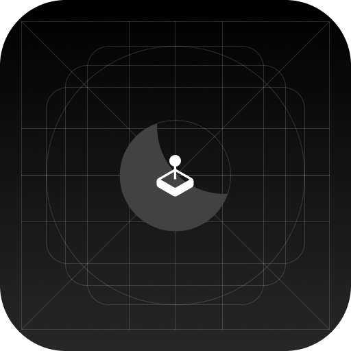

# VesperiOS MoonDust
The gaming-focused flavor of VesperiOS.

## But... why tho?
Remember I said that this was a school project?, well, **this is it!**. You see, there's no specific reason to justify the creation of VesperiOS MoonDust, unlike its brother, VesperiOS Lunar, which has a reason to exist.

## If this will be ARM64-only, how tf will this be "gamer"?
Well, that's a good question. We will use some tools to run x86 binaries in ARM through emulation. If that doesn't make my laptop explode, we'll proceed to use things like Wine to run Windows games, and some other stuff like DXVK/vkd3d to run DirectX-only games.

## ⚠️ A huge thing to consider
This Linux distro will be optimized for M1 MacBooks, since that's what I'm using to test and build. I don't guarantee Snapdragon support, nor other SoC that's not the Apple M1/M2.
